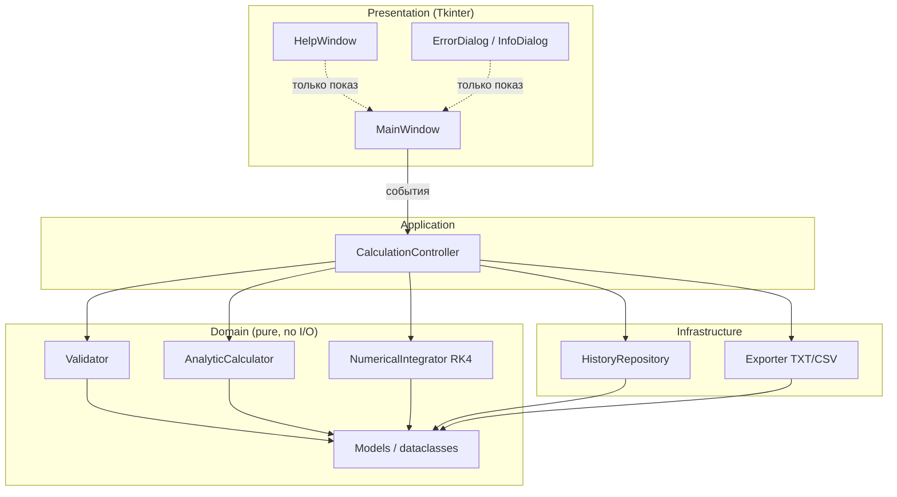
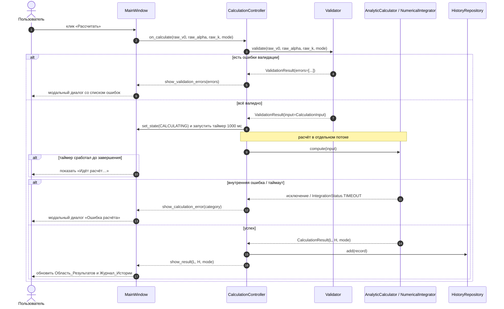
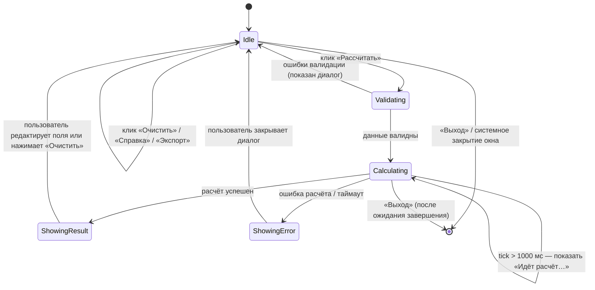

# Design Document

## Overview

Калькулятор траектории полёта тела, брошенного под углом к горизонту, представляет собой настольное GUI-приложение под Windows 7+, реализованное на Python 3.10+ с использованием стандартной библиотеки Tkinter. Архитектурно приложение организовано как четырёхслойная система (Presentation → Application → Domain → Infrastructure) с явным разделением чистой расчётной логики и внешних эффектов (GUI, файловый ввод/вывод). Такая структура решает три задачи одновременно:

- **Тестируемость.** Слой Domain (валидация, аналитический расчёт, численный интегратор RK4) свободен от Tkinter и I/O, поэтому его можно покрыть property-based тестами через Hypothesis без поднятия GUI.
- **Автономность.** Production-код использует только Python stdlib (`math`, `tkinter`, `csv`, `dataclasses`, `enum`, `pathlib`, `threading`). Никаких сетевых клиентов, никаких внешних динамических библиотек — это удовлетворяет нефункциональным требованиям 12.3, 12.4, 12.5, 12.6 (работа на Windows 7+ без прав администратора, локально, без сети).
- **Отзывчивость GUI.** Численное интегрирование с шагом 0.001 с при T_max = 600 с в худшем случае может занять заметное время; чтобы не нарушать требование 12.7 («Идёт расчёт…») и 12.8 (отзывчивость окна), расчёты выполняются в отдельном `threading.Thread`, а результат возвращается в основной поток через очередь и `widget.after()`.

Документ описывает архитектуру, публичные интерфейсы компонентов, модели данных, стратегию обработки ошибок и тестирования, а также формальные свойства корректности (Correctness Properties), которые будут переведены в Hypothesis-тесты на этапе реализации.

## Architecture

### Слоистая модель

Приложение разделено на четыре слоя. Каждый слой зависит только от того, что находится «ниже» по диаграмме (Presentation → Application → Domain; Infrastructure используется Application и не зависит от Presentation/Domain).



### Описание слоёв

**Presentation (`projectile_calculator/presentation/`).** Содержит исключительно код, работающий с Tkinter. Не выполняет никаких вычислений, не разбирает строки в числа и не обращается к файловой системе напрямую — все эти действия делегируются контроллеру. Состоит из трёх типов окон:

- `MainWindow` — главное окно 800×600 (Req 13.1, 13.3): Форма_Ввода (поля v₀, α, k, чекбокс «учитывать сопротивление воздуха»), Область_Результатов («Дальность:», «Максимальная высота:», метка режима), панель кнопок (`Рассчитать`, `Очистить`, `Справка`, `Экспорт`, `Выход`), область Журнала_Истории.
- `HelpWindow` — модальное окно справки с формулами и правилами ввода (Req 7).
- `Dialogs` — функции-обёртки над `tkinter.messagebox` и `tkinter.filedialog` (`show_validation_errors`, `show_calculation_error`, `show_io_error`, `show_info`, `ask_save_path`, `ask_overwrite`).

**Application (`projectile_calculator/application/`).** Содержит `CalculationController` — единственный класс, связывающий GUI с доменом. Контроллер не знает про Tkinter напрямую (получает уже извлечённые значения полей и колбэки для отображения результата/ошибки), что упрощает unit-тестирование контроллера без поднятия GUI.

**Domain (`projectile_calculator/domain/`).** Чистый Python без побочных эффектов:

- `models.py` — value objects (`CalculationInput`, `CalculationResult`, `Mode`, `ValidationError`, `ValidationResult`, `IntegrationStatus`).
- `validator.py` — `Validator` валидирует сырые строки из GUI согласно Req 2.
- `analytic.py` — `AnalyticCalculator` реализует Req 3 (формулы L = v₀²·sin(2α)/g, H = (v₀·sin(α))²/(2g)).
- `numerical.py` — `NumericalIntegrator` реализует Req 4 (RK4, Δt = 0.001 с, T_max = 600 с, линейная интерполяция в точке y = 0).

**Infrastructure (`projectile_calculator/infrastructure/`).** Внешние эффекты, кроме GUI:

- `history.py` — `HistoryRepository`, in-memory FIFO-очередь ёмкостью 100 (Req 8.6). Очищается при выходе из приложения (Req 8.4).
- `exporter.py` — `Exporter`, запись истории в TXT/CSV (Req 9). Кодировка UTF-8, разделитель CSV — `;` (Req 9.4).

### Поток управления при нажатии «Рассчитать»



### Состояния главного окна



Состояние `Calculating` блокирует кнопки `Рассчитать` и `Очистить` (последняя дожидается завершения расчёта согласно Req 6.7), но не блокирует `Выход` (Req 12.8) и не замораживает перерисовку окна.

### Управление потоками

- Главный поток: Tkinter mainloop, обработчики событий, обновление виджетов.
- Рабочий поток (`threading.Thread(daemon=True)`): один экземпляр на расчёт. Принимает `CalculationInput`, кладёт результат или исключение в `queue.Queue`. Главный поток через `root.after(50, poll_queue)` периодически опрашивает очередь.
- `HistoryRepository` и обновление виджетов вызываются только из главного потока (Tk не потокобезопасен).
- Через `root.after(1000, show_progress_indicator)` запускается отложенное отображение «Идёт расчёт…» (Req 12.7); если результат пришёл раньше, таймер отменяется.

## Components and Interfaces

Все интерфейсы ниже даны в виде Python-сигнатур с типовыми аннотациями и краткими docstring. Сигнатуры — публичный контракт между слоями; внутренние вспомогательные функции в этом разделе не описываются.

### Domain: модели данных и перечисления

```python
# projectile_calculator/domain/models.py
from dataclasses import dataclass, field
from datetime import datetime
from enum import Enum

class Mode(Enum):
    """Режим расчёта."""
    NO_DRAG = "no_drag"          # Режим_Без_Сопротивления
    WITH_DRAG = "with_drag"      # Режим_С_Сопротивлением

class IntegrationStatus(Enum):
    """Статус завершения численного интегрирования."""
    LANDED = "landed"            # пересечение y = 0 при vy < 0
    TIMEOUT = "timeout"          # достигнут T_max = 600 с (Req 4.3, 4.8)

class CalculationErrorCategory(Enum):
    """Категория внутренней ошибки расчёта (Req 11.7)."""
    OVERFLOW = "overflow"
    DIVISION_BY_ZERO = "division_by_zero"
    DOMAIN_ERROR = "domain_error"     # sqrt отрицательного, log неположительного
    TIMEOUT = "timeout"               # T_max превышен (Req 4.8)
    UNKNOWN = "unknown"

@dataclass(frozen=True)
class CalculationInput:
    """Уже валидированные входные данные расчёта.

    Создаётся только Validator-ом. Все значения — в SI единицах.
    """
    v0: float          # м/с, 0 < v0 ≤ 1000
    alpha_deg: float   # градусы, 0 < alpha_deg < 90
    k: float           # кг/с, 0 ≤ k ≤ 100
    mode: Mode

@dataclass(frozen=True)
class CalculationResult:
    """Результат успешного расчёта."""
    L: float                       # дальность, м, ≥ 0
    H: float                       # макс. высота, м, ≥ 0
    mode: Mode
    timestamp: datetime

@dataclass(frozen=True)
class ValidationError:
    """Описание одной ошибки валидации (Req 2, Req 11.1, 11.2)."""
    field_name: str        # подпись поля как в GUI: "Начальная скорость v₀"
    field_id: str          # технический id: "v0" | "alpha" | "k"
    raw_value: str         # как было введено пользователем
    message: str           # текст для диалога
    allowed_min: float | None
    allowed_max: float | None
    format_hint: str       # описание допустимого формата

@dataclass(frozen=True)
class ValidationResult:
    """Результат валидации формы целиком."""
    input: CalculationInput | None
    errors: tuple[ValidationError, ...] = ()

    @property
    def is_valid(self) -> bool:
        return self.input is not None and not self.errors

@dataclass(frozen=True)
class HistoryRecord:
    """Запись в Журнале_Истории (Req 8.1)."""
    input: CalculationInput
    result: CalculationResult
```

### Domain: Validator

```python
# projectile_calculator/domain/validator.py
class Validator:
    """Валидация введённых пользователем строк (Req 2).

    Не зависит от GUI: принимает уже извлечённые строковые значения и
    возвращает агрегированный ValidationResult со всеми ошибками за один
    проход (Req 2.9, 11.3).
    """

    V0_MIN: float = 0.01
    V0_MAX: float = 1000.0
    V0_DECIMALS: int = 2
    ALPHA_MIN_EXCLUSIVE: float = 0.0
    ALPHA_MAX_EXCLUSIVE: float = 90.0
    ALPHA_DECIMALS: int = 2
    K_MIN: float = 0.0
    K_MAX: float = 100.0
    K_DECIMALS: int = 3
    MAX_INPUT_LENGTH: int = 15

    def validate(
        self,
        raw_v0: str,
        raw_alpha: str,
        raw_k: str,
        mode: Mode,
    ) -> ValidationResult:
        """Полная валидация формы.

        Алгоритм:
        1. Для каждого поля проверяется непустота (Req 2.7), длина строки
           ≤ MAX_INPUT_LENGTH, число знаков после разделителя.
        2. Строка нормализуется (запятая → точка) и парсится во float
           (Req 1.4, 2.8).
        3. Проверяется диапазон.
        4. Все обнаруженные ошибки собираются в кортеж и возвращаются
           ОДНИМ ValidationResult (Req 2.9).
        5. Если mode == NO_DRAG, поле k не валидируется по диапазону
           (используется 0.0 неявно), но проверяется только если
           переключатель WITH_DRAG (Req 1.8).
        """
        ...

    @staticmethod
    def parse_decimal(raw: str) -> float:
        """Преобразовать строку с десятичной запятой или точкой во float.

        Raises ValueError, если строка не является корректным числом.
        Не выполняет проверку диапазона.
        """
        ...
```

### Domain: AnalyticCalculator

```python
# projectile_calculator/domain/analytic.py
import math

G: float = 9.81  # м/с² (Req 3.3)

class AnalyticCalculator:
    """Расчёт без учёта сопротивления воздуха (Req 3)."""

    def compute(self, v0: float, alpha_deg: float) -> tuple[float, float]:
        """Вычислить (L, H) по аналитическим формулам.

        L = v0² · sin(2α) / g            (Req 3.1)
        H = (v0 · sin(α))² / (2g)         (Req 3.2)

        α конвертируется в радианы перед math.sin (Req 3.4).

        Args:
            v0: начальная скорость, м/с, 0 < v0 ≤ 1000
            alpha_deg: угол броска, градусы, 0 < alpha_deg < 90

        Returns:
            (L, H) в метрах, без округления — округление выполняет
            форматтер в Presentation-слое.

        Raises:
            OverflowError: если результат выходит за диапазон float
                (для разумных входов это невозможно).
        """
        ...
```

### Domain: NumericalIntegrator

```python
# projectile_calculator/domain/numerical.py
class NumericalIntegrator:
    """Численное решение уравнений движения с сопротивлением воздуха
    методом Рунге-Кутты 4-го порядка (Req 4).

    Уравнения движения для модели F = -k·v:
        dx/dt = vx
        dy/dt = vy
        dvx/dt = -(k/m) · vx
        dvy/dt = -(k/m) · vy - g

    В рамках задачи масса m принята равной 1 кг (k имеет размерность кг/с
    по ТЗ; параметр m не входит в Форму_Ввода).
    """

    DEFAULT_DT: float = 0.001        # с (Req 4.2)
    DEFAULT_T_MAX: float = 600.0     # с (Req 4.3)

    def compute(
        self,
        v0: float,
        alpha_deg: float,
        k: float,
        dt: float = DEFAULT_DT,
        t_max: float = DEFAULT_T_MAX,
    ) -> tuple[float, float, IntegrationStatus]:
        """Запустить численное интегрирование.

        Args:
            v0: начальная скорость, м/с
            alpha_deg: угол броска, градусы
            k: коэффициент сопротивления, кг/с (k ≥ 0)
            dt: шаг интегрирования
            t_max: предельное время интегрирования

        Returns:
            (L, H, status):
              status == LANDED  — L получен линейной интерполяцией между
                                   двумя последними шагами при пересечении
                                   y = 0 (Req 4.4); H — максимум y за весь
                                   полёт (Req 4.5).
              status == TIMEOUT — достигнут t_max до пересечения y = 0
                                   (Req 4.3); вызывающий код обязан
                                   трактовать это как ошибку (Req 4.8) и
                                   не отображать L и H.

        Не бросает исключений на корректных входах. На некорректных
        (v0 < 0, alpha вне (0, 90), k < 0) поведение не определено —
        проверки выполняет Validator.
        """
        ...
```

### Application: CalculationController

```python
# projectile_calculator/application/controller.py
from typing import Callable
import queue
import threading

class CalculationController:
    """Связывает GUI и Domain. Не импортирует tkinter напрямую.

    Колбэки для UI-обновлений передаются конструктором, что позволяет
    подменять их моками в unit-тестах.
    """

    def __init__(
        self,
        validator: Validator,
        analytic: AnalyticCalculator,
        numerical: NumericalIntegrator,
        history: HistoryRepository,
        exporter: Exporter,
        on_validation_errors: Callable[[tuple[ValidationError, ...]], None],
        on_calculation_error: Callable[[CalculationErrorCategory], None],
        on_result: Callable[[CalculationResult], None],
        on_progress_visible: Callable[[bool], None],
        schedule_main_thread: Callable[[Callable[[], None]], None],
    ) -> None: ...

    def on_calculate(
        self,
        raw_v0: str,
        raw_alpha: str,
        raw_k: str,
        mode: Mode,
    ) -> None:
        """Обработать клик «Рассчитать».

        1. Валидация (синхронно).
        2. Если есть ошибки — on_validation_errors и выход.
        3. Запуск рабочего потока с расчётом.
        4. Через schedule_main_thread доставка результата/ошибки в UI.
        """
        ...

    def on_clear(self) -> None:
        """Обработать клик «Очистить» (Req 6).
        Дожидается активного расчёта (Req 6.7), затем очищает форму через
        колбэк UI. Не очищает Журнал_Истории (Req 6.5).
        """
        ...

    def on_export(self, target_path: str, fmt: ExportFormat) -> None:
        """Обработать подтверждение диалога экспорта (Req 9).
        Если history пуст — UI должен это проверить ДО открытия диалога
        (Req 9.7), но контроллер дополнительно защищается.
        """
        ...
```

### Infrastructure: HistoryRepository

```python
# projectile_calculator/infrastructure/history.py
from collections import deque
from typing import Iterable

class HistoryRepository:
    """In-memory FIFO-журнал на 100 записей (Req 8.6).

    Очищается при завершении приложения автоматически — данные не
    персистятся (Req 8.4).
    """

    CAPACITY: int = 100

    def __init__(self) -> None:
        self._records: deque[HistoryRecord] = deque(maxlen=self.CAPACITY)

    def add(self, record: HistoryRecord) -> None:
        """Добавить запись. При переполнении самая ранняя удаляется (FIFO,
        Req 8.6)."""
        ...

    def list_newest_first(self) -> tuple[HistoryRecord, ...]:
        """Записи в порядке убывания времени добавления (Req 8.3)."""
        ...

    def list_oldest_first(self) -> tuple[HistoryRecord, ...]:
        """Записи в порядке добавления — для экспорта (Req 9.3)."""
        ...

    def clear(self) -> None:
        """Полная очистка — вызывается при завершении приложения."""
        ...

    def __len__(self) -> int: ...
```

### Infrastructure: Exporter

```python
# projectile_calculator/infrastructure/exporter.py
from enum import Enum
from pathlib import Path

class ExportFormat(Enum):
    TXT = "txt"
    CSV = "csv"

class Exporter:
    """Экспорт Журнала_Истории в файл (Req 9).

    Кодировка UTF-8 (Req 9.3). CSV-разделитель — `;` (Req 9.4).
    Используется временный файл и атомарный rename, чтобы при ошибке
    записи существующий файл не повреждался (Req 9.6).
    """

    CSV_HEADER: tuple[str, ...] = (
        "v0_m_s", "alpha_deg", "k", "mode", "L_m", "H_m",
    )

    def export(
        self,
        records: Iterable[HistoryRecord],
        path: Path,
        fmt: ExportFormat,
    ) -> None:
        """Записать records в path. Записи идут в порядке от самой ранней
        к самой поздней (Req 9.3)."""
        ...

    @staticmethod
    def ensure_extension(path: Path, fmt: ExportFormat) -> Path:
        """Добавить расширение .txt / .csv, если у пути его нет
        (Req 9.11)."""
        ...
```

### Presentation: главное окно и диалоги

```python
# projectile_calculator/presentation/main_window.py
import tkinter as tk
from tkinter import ttk

class MainWindow:
    """Главное окно приложения (Req 13).

    Имеет фиксированный layout: Форма_Ввода (top), Область_Результатов
    (center), Панель_Кнопок (bottom), Журнал_Истории (правая или нижняя
    панель внутри центра — выбор делается на этапе верстки).
    Минимальный размер 800×600 (Req 13.1), заголовок «Калькулятор
    траектории полёта» (Req 13.3).
    """

    def __init__(self, root: tk.Tk, controller: CalculationController) -> None: ...

    # обработчики UI-событий
    def _on_calculate_click(self) -> None: ...
    def _on_clear_click(self) -> None: ...
    def _on_help_click(self) -> None: ...
    def _on_export_click(self) -> None: ...
    def _on_exit_click(self) -> None: ...
    def _on_drag_toggle(self) -> None:
        """Включает/отключает редактируемость поля k (Req 1.8)."""
        ...
    def _on_field_changed(self, *_args) -> None:
        """Скрывает диалог ошибки при следующем редактировании (Req 2.10)
        и обновляет состояние кнопки Рассчитать (Req 13.4, 13.5).
        """
        ...

    # обновления, вызываемые контроллером
    def show_result(self, result: CalculationResult) -> None: ...
    def show_progress(self, visible: bool) -> None: ...
    def reset_results_to_placeholder(self) -> None: ...
    def refresh_history(self, records: tuple[HistoryRecord, ...]) -> None: ...
```

```python
# projectile_calculator/presentation/help_window.py
class HelpWindow:
    """Окно_Справки (Req 7).

    Singleton: при повторном вызове .show() возвращает фокус существующему
    окну, не создавая дубликата (Req 7.3). Закрывается по Escape и
    системной кнопке (Req 7.8).
    """

    def __init__(self, parent: tk.Tk) -> None: ...
    def show(self) -> None: ...
    def _on_close(self) -> None: ...
```

```python
# projectile_calculator/presentation/dialogs.py
def show_validation_errors(parent: tk.Misc, errors: tuple[ValidationError, ...]) -> None:
    """Модальный диалог со списком всех ошибок валидации, по строке на
    поле (Req 11.3, 11.4). Принимает Enter / Esc / OK (Req 11.5).
    После закрытия фокус устанавливается в первое ошибочное поле по
    Tab-порядку (Req 11.6) — реализуется в MainWindow по
    возвращаемому field_id первой ошибки.
    """
    ...

def show_calculation_error(parent: tk.Misc, category: CalculationErrorCategory) -> None:
    """Модальный диалог «Ошибка расчёта» с категорией (Req 11.7)."""
    ...

def show_io_error(parent: tk.Misc, error: OSError) -> None:
    """Сообщение об ошибке ввода-вывода при экспорте (Req 9.6)."""
    ...

def ask_save_path(parent: tk.Misc) -> tuple[Path, ExportFormat] | None:
    """Системный диалог сохранения с фильтрами .txt/.csv и предложением
    имени по умолчанию projectile_history (Req 9.2). Возвращает None при
    нажатии «Отмена» (Req 9.10).
    """
    ...
```

## Data Models

Все модели — `@dataclass(frozen=True)`, что обеспечивает иммутабельность и хеш-совместимость (нужно для тестов equality в Hypothesis).

| Модель | Назначение | Ключевые поля | Инварианты |
|---|---|---|---|
| `Mode` | Перечисление режимов расчёта | `NO_DRAG`, `WITH_DRAG` | — |
| `IntegrationStatus` | Исход RK4 | `LANDED`, `TIMEOUT` | — |
| `CalculationErrorCategory` | Категории ошибок расчёта (Req 11.7) | `OVERFLOW`, `DIVISION_BY_ZERO`, `DOMAIN_ERROR`, `TIMEOUT`, `UNKNOWN` | — |
| `CalculationInput` | Валидированный вход | `v0: float`, `alpha_deg: float`, `k: float`, `mode: Mode` | 0.01 ≤ v0 ≤ 1000; 0 < alpha_deg < 90; 0 ≤ k ≤ 100 |
| `CalculationResult` | Успешный результат | `L: float`, `H: float`, `mode: Mode`, `timestamp: datetime` | L ≥ 0; H ≥ 0 |
| `ValidationError` | Одна ошибка одного поля | `field_name`, `field_id`, `raw_value`, `message`, `allowed_min`, `allowed_max`, `format_hint` | field_id ∈ {`v0`, `alpha`, `k`} |
| `ValidationResult` | Итог валидации формы | `input: CalculationInput \| None`, `errors: tuple[ValidationError, ...]` | `is_valid ⇔ input ≠ None ∧ errors == ()` |
| `HistoryRecord` | Запись Журнала_Истории | `input: CalculationInput`, `result: CalculationResult` | input.mode == result.mode |

### Сценарий жизненного цикла данных

1. Пользователь вводит строки в три поля (`raw_v0`, `raw_alpha`, `raw_k`) и устанавливает `mode`.
2. `Validator.validate(...)` возвращает `ValidationResult`. При ошибках работа останавливается, ввод сохраняется в полях (Req 2.4–2.7).
3. При успехе создаётся `CalculationInput`, передаётся в `AnalyticCalculator` или `NumericalIntegrator` в зависимости от `mode`.
4. Результат оборачивается в `CalculationResult`, затем в `HistoryRecord` и сохраняется в `HistoryRepository`.
5. UI читает `HistoryRepository.list_newest_first()` для отображения, `list_oldest_first()` — для экспорта.

### Форматирование значений в UI

Округление производится при выводе (Req 3.7, 4.9, 5.4). Используется банкирское округление НЕ применяется — задача требует «значение 5 в отбрасываемом разряде округляется в большую сторону по абсолютной величине» (Req 5.4), что соответствует стандартному «round half away from zero». Реализация:

```python
def round_to_centimeter(x: float) -> float:
    """Round half away from zero до 2 знаков (Req 5.4)."""
    return math.copysign(math.floor(abs(x) * 100 + 0.5) / 100, x) if x != 0 else 0.0

def format_meters(x: float) -> str:
    """Форматирование с запятой как разделителем (Req 5.4): '12,34'."""
    return f"{round_to_centimeter(x):.2f}".replace(".", ",")
```

`format_meters` — единственное место, где десятичная точка превращается в запятую при выводе. Парсинг ввода (запятая → точка) изолирован в `Validator.parse_decimal`.

## Error Handling

Стратегия обработки ошибок построена на принципе «failing layer decides the category, presentation layer renders the message». Контроллер ловит все ожидаемые исключения от Domain и преобразует их в значения `CalculationErrorCategory`; Presentation отвечает только за тексты диалогов на русском.

### Категории ошибок и их обработка

| Источник | Тип ошибки | Где ловится | Реакция UI | Требования |
|---|---|---|---|---|
| Validator | `ValidationError` (агрегированный список) | Не исключение, а часть `ValidationResult` | Один модальный диалог со всеми ошибками | Req 2.4–2.10, 11.1–11.6 |
| AnalyticCalculator | `OverflowError` от `math.sin/v0**2` | Контроллер | `Ошибка расчёта` / `OVERFLOW` | Req 11.7 |
| AnalyticCalculator | `ZeroDivisionError` (теоретически невозможно при g = 9.81, но защита) | Контроллер | `Ошибка расчёта` / `DIVISION_BY_ZERO` | Req 11.7 |
| AnalyticCalculator | `ValueError` от math.sqrt/log (теор. невозможно) | Контроллер | `Ошибка расчёта` / `DOMAIN_ERROR` | Req 11.7 |
| NumericalIntegrator | `IntegrationStatus.TIMEOUT` (значение, не исключение) | Контроллер | `Ошибка расчёта` / `TIMEOUT` | Req 4.8, 11.7 |
| NumericalIntegrator | `OverflowError` от роста значений в RK4 | Контроллер | `Ошибка расчёта` / `OVERFLOW` | Req 11.7 |
| Exporter | `PermissionError` | Контроллер | Диалог с категорией «нет прав на запись» | Req 9.6 |
| Exporter | `OSError` (`errno.ENOSPC`) | Контроллер | Диалог с категорией «нехватка места» | Req 9.6 |
| Exporter | `OSError` (прочее, например `EINVAL`, `ENOENT`) | Контроллер | Диалог с категорией «недопустимый путь / общая ошибка ввода-вывода» | Req 9.6 |
| Exporter | `UnicodeEncodeError` | Контроллер | Диалог «ошибка кодирования» — теоретически возможно, если в данных непечатаемые символы (на практике — нет, числа и enum) | защитная мера |
| Exit | таймаут при освобождении ресурсов | `WindowManager` | Диалог «ошибка завершения», затем `os._exit(1)` через 5 с | Req 10.4 |

### Поведение после показа диалога ошибки

- Поля Формы_Ввода не очищаются (Req 2.4–2.7, 11.6, 11.8).
- Область_Результатов: численные значения заменяются на `—`, подписи и метка режима не трогаются (Req 5.7, 11.8).
- Журнал_Истории не пополняется (Req 8.5).
- После закрытия диалога валидации фокус переходит в первое поле с ошибкой по Tab-порядку (v0 → alpha → k) (Req 11.6).
- После закрытия диалога расчётной ошибки фокус возвращается в главное окно, приложение остаётся работоспособным без перезапуска (Req 11.8).

### Атомарность экспорта

`Exporter.export` пишет данные во временный файл `<target>.tmp` и затем выполняет `os.replace(tmp, target)`. При исключении до `os.replace` исходный файл не модифицируется — это удовлетворяет Req 9.6 «не повреждать ранее существующий файл по тому же пути». Подтверждение перезаписи (Req 9.8) делает уже сам `tkinter.filedialog.asksaveasfilename` через флаг `confirmoverwrite=True`.

### Завершение работы

Закрытие главного окна (по кнопке «Выход» или системному «×») последовательно:

1. Если идёт расчёт — рабочий поток помечается на остановку (`stop_event`), главный поток ждёт `thread.join(timeout=2.5)`.
2. `HelpWindow` (если открыт) закрывается.
3. `HistoryRepository.clear()` (Req 8.4).
4. `root.destroy()`.
5. Если на любом шаге накопилось > 3 с, показывается диалог «Ошибка завершения», затем через `root.after(5000, lambda: os._exit(1))` процесс убивается принудительно (Req 10.4).

## Testing Strategy

### Подход

Используется двухуровневый подход: example-based unit-тесты + property-based тесты на Hypothesis. Юнит-тесты подтверждают корректность на конкретных учебных примерах из ТЗ, property-тесты обеспечивают покрытие пространства входов и выявление пограничных случаев.

### Уровни тестов

1. **Unit-тесты Domain (синхронные, без GUI).**
   - `test_validator.py`: граничные значения (v0=0.01, v0=1000, alpha=0.001, alpha=89.999, k=0, k=100), запятая/точка как разделитель, превышение длины строки и числа знаков, пустые строки, агрегирование нескольких ошибок.
   - `test_analytic.py`: эталонные примеры (v0=10 м/с, α=45°: L = 100·1/9.81 ≈ 10.193 м, H = 50·0.5/9.81 ≈ 2.548 м); симметрия α и 90°−α; α=45° даёт максимум L для фиксированного v0.
   - `test_numerical.py`: при k=0 совпадение с аналитической формулой ≤ 0.01 м (Req 4.7); при возрастании k убывание L и H; статус TIMEOUT при искусственно малом t_max.

2. **Unit-тесты Infrastructure.**
   - `test_history.py`: добавление до и после переполнения, порядок выдачи (newest_first / oldest_first), очистка.
   - `test_exporter.py`: формат CSV (заголовки, разделитель `;`), формат TXT (блоки «параметр: значение» с пустой строкой между записями), автодобавление расширения, атомарность при ошибке записи (используется monkeypatch для имитации `OSError`).

3. **Property-based тесты (Hypothesis) — `test_properties.py`.**
   - Минимум 100 итераций на свойство (`@settings(max_examples=200)`).
   - Каждый тест помечен комментарием формата: `# Feature: projectile-calculator, Property N: <текст>`.
   - Каждое свойство соответствует одной CP из секции Correctness Properties.
   - Стратегии генерации:
     - `v0`: `st.floats(min_value=0.01, max_value=1000.0, allow_nan=False, allow_infinity=False)` с округлением до 2 знаков.
     - `alpha`: `st.floats(min_value=0.01, max_value=89.99, allow_nan=False, allow_infinity=False)` с округлением до 2 знаков.
     - `k`: `st.floats(min_value=0.0, max_value=100.0, allow_nan=False, allow_infinity=False)` с округлением до 3 знаков.
     - Строки для парсинга: `st.from_regex(r'-?\d{1,4}([.,]\d{1,3})?', fullmatch=True)`.
   - Эталонное решение для проверки точности численного интегрирования: тот же RK4 с шагом `dt_ref = 1e-5`. Из-за стоимости такие тесты помечаются `@pytest.mark.slow` и запускаются отдельно (`pytest -m slow`).

4. **Интеграционные тесты GUI.**
   - Поднятие `tk.Tk()` в headless-режиме невозможно на Windows без Xvfb; вместо автоматизации делается ручной чек-лист по сценариям из требований (запуск приложения < 5 с, активация кнопки «Рассчитать», открытие/закрытие справки, экспорт в TXT/CSV, поведение при отсутствии прав записи). Чек-лист хранится в `tests/manual_checklist.md` (создаётся на этапе реализации).
   - Дополнительно — два «smoke»-pytest-теста, импортирующие `projectile_calculator.presentation.main_window` и проверяющие, что класс `MainWindow` создаётся без ошибок при наличии переменной окружения `DISPLAY` или на Windows-агенте.

5. **Производительность.**
   - Тест замера времени аналитического расчёта (≤ 1000 мс на эталонной конфигурации, Req 12.1) — фактически выполняется за единицы микросекунд.
   - Тест-замер «худшего» сценария RK4 (k=0.001, большой v0, большой угол): должен укладываться в T_max и не превышать заметную долю секунды на современном железе. Не входит в обязательный набор, выполняется по требованию.

### Соответствие тестов требованиям

| Группа | Покрывает требования |
|---|---|
| `test_validator.py` | 1.1–1.6, 1.8, 2.1–2.10, 11.1–11.3 |
| `test_analytic.py` | 3.1–3.7 |
| `test_numerical.py` | 4.1–4.9 |
| `test_history.py` | 8.1, 8.3, 8.5, 8.6 |
| `test_exporter.py` | 9.3–9.6, 9.11 |
| `test_properties.py` | соответствует CP1–CP10 (см. ниже) |
| Ручной чек-лист | 5.1–5.7, 6.1–6.7, 7.1–7.8, 9.1–9.2, 9.7–9.10, 10.1–10.4, 11.4–11.8, 12.1–12.8, 13.1–13.7 |

### Конфигурация Hypothesis

```python
# tests/conftest.py
from hypothesis import settings, HealthCheck, Phase

settings.register_profile(
    "default",
    max_examples=200,
    deadline=None,                        # RK4 может занимать время
    suppress_health_check=[HealthCheck.too_slow],
)
settings.register_profile(
    "ci",
    max_examples=500,
    phases=(Phase.explicit, Phase.reuse, Phase.generate, Phase.target, Phase.shrink),
    deadline=None,
)
settings.load_profile("default")
```


## Correctness Properties

*A property is a characteristic or behavior that should hold true across all valid executions of a system — essentially, a formal statement about what the system should do. Properties serve as the bridge between human-readable specifications and machine-verifiable correctness guarantees.*

Свойства ниже сформулированы универсально (с явным «для любого…») и пронумерованы 1…14. Каждое будет покрыто одним property-based тестом в `tests/test_properties.py` с минимум 100 итерациями (Hypothesis `@settings(max_examples=200)`). Тесты тегируются комментарием `# Feature: projectile-calculator, Property N: …`.

### Property 1: Эквивалентность парсинга запятой и точки

*Для любой* строки `s`, представляющей корректное десятичное число, `Validator.parse_decimal(s.replace('.', ','))` равно `Validator.parse_decimal(s.replace(',', '.'))`. На некорректных строках обе формы поднимают `ValueError`.

**Validates: Requirements 1.4, 2.8**

### Property 2: Корректность валидации формы

*Для любых* трёх строк `raw_v0`, `raw_alpha`, `raw_k` и режима `mode` справедливо:

- `Validator.validate(raw_v0, raw_alpha, raw_k, mode).is_valid` возвращает `True` тогда и только тогда, когда каждое из применимых полей одновременно (a) непусто и не состоит только из пробелов, (b) длина строки ≤ 15 символов, (c) парсится как число, (d) число знаков после разделителя соответствует ограничению поля (2 для v0/alpha, 3 для k), (e) числовое значение лежит в допустимом диапазоне поля, причём поле `k` валидируется только при `mode == WITH_DRAG`.
- При наличии ошибок в `n` полях возвращаемый `errors` содержит ровно `n` элементов (по одному на поле), каждый из которых содержит `field_name` (точная подпись из GUI), числовые границы (`allowed_min`, `allowed_max`) и текстовое сообщение, упоминающее эти границы и допустимый формат.

**Validates: Requirements 2.1, 2.2, 2.3, 2.4, 2.5, 2.6, 2.7, 2.9, 11.1, 11.2, 11.3**

### Property 3: Аналитическая дальность

*Для любых* `v0 ∈ [0.01, 1000]` и `alpha_deg ∈ (0, 90)` результат `AnalyticCalculator.compute(v0, alpha_deg)` удовлетворяет:
`abs(L − v0 ** 2 * sin(2 * radians(alpha_deg)) / 9.81) ≤ 1e-6`.

**Validates: Requirements 3.1, 3.3, 3.4, 3.5**

### Property 4: Аналитическая высота

*Для любых* `v0 ∈ [0.01, 1000]` и `alpha_deg ∈ (0, 90)` результат `AnalyticCalculator.compute(v0, alpha_deg)` удовлетворяет:
`abs(H − (v0 * sin(radians(alpha_deg))) ** 2 / (2 * 9.81)) ≤ 1e-6`.

**Validates: Requirements 3.2, 3.3, 3.4, 3.5**

### Property 5: Согласованность режимов при k = 0

*Для любых* `v0 ∈ [0.01, 1000]` и `alpha_deg ∈ (0, 90)` пусть `(L_a, H_a) = AnalyticCalculator.compute(v0, alpha_deg)` и `(L_n, H_n, status) = NumericalIntegrator.compute(v0, alpha_deg, k=0)`. Тогда `status == LANDED`, `abs(L_a − L_n) ≤ 0.01` и `abs(H_a − H_n) ≤ 0.01`.

**Validates: Requirements 4.1, 4.2, 4.4, 4.5, 4.7**

### Property 6: Завершение численного интегрирования

*Для любых* `v0 ∈ [0.01, 1000]`, `alpha_deg ∈ (0, 90)` и `k ∈ [0, 100]` `NumericalIntegrator.compute(v0, alpha_deg, k)` со штатными `dt = 0.001` и `t_max = 600` возвращает `status == LANDED`, причём после интерполяции `y(L) ≤ 1e-6`.

**Validates: Requirements 4.3**

### Property 7: Точность численного интегрирования

*Для любых* `v0 ∈ [0.01, 1000]`, `alpha_deg ∈ (0, 90)` и `k ∈ [0, 100]` пусть `(L_n, H_n, _) = NumericalIntegrator.compute(v0, alpha_deg, k, dt=0.001)` и `(L_ref, H_ref, _) = NumericalIntegrator.compute(v0, alpha_deg, k, dt=1e-5)`. Тогда `abs(L_n − L_ref) ≤ 0.01` и `abs(H_n − H_ref) ≤ 0.01`. Тест помечается `@pytest.mark.slow` из-за стоимости reference-решения.

**Validates: Requirements 4.6**

### Property 8: Метаморфическая монотонность по k

*Для любых* `v0 ∈ [0.01, 1000]`, `alpha_deg ∈ (0, 90)` и пары `0 ≤ k1 < k2 ≤ 100` справедливо `L(v0, α, k1) ≥ L(v0, α, k2) − ε` и `H(v0, α, k1) ≥ H(v0, α, k2) − ε`, где `ε = 0.01` м. Это физически очевидное свойство модели F = -k·v: рост трения не увеличивает ни дальность, ни высоту.

**Validates: Requirements 4.1**

### Property 9: Идемпотентность округления и формат вывода

*Для любого* `x ∈ [0, 1e9]` (а также для `x = 0`) функция округления и форматирования удовлетворяет:

- `round_to_centimeter(round_to_centimeter(x)) == round_to_centimeter(x)` (идемпотентность);
- результат `round_to_centimeter(x)` кратен `0.01` (`abs(round(x * 100) − x_rounded * 100) < 1e-9`);
- строка `format_meters(x)` соответствует регулярному выражению `^\d+,\d{2}$` — содержит ровно одну запятую, ровно две цифры после неё, не содержит точку и пробельные разделители разрядов.

**Validates: Requirements 3.7, 4.9, 5.4**

### Property 10: FIFO-инварианты Журнала_Истории

*Для любой* последовательности из `N` корректно построенных `HistoryRecord`, последовательно добавленных в свежий `HistoryRepository`:

- `len(repo) == min(N, 100)`;
- последняя добавленная запись присутствует в `repo.list_newest_first()` и стоит первой;
- `repo.list_newest_first() == tuple(reversed(repo.list_oldest_first()))`;
- при `N > 100` ни одна из последних 100 добавленных записей не теряется.

**Validates: Requirements 8.1, 8.3, 8.6**

### Property 11: Round-trip экспорта истории

*Для любого* непустого списка `records: list[HistoryRecord]` и любого `fmt ∈ {TXT, CSV}` после `Exporter.export(records, path, fmt)` повторное чтение файла парсером (определяется тестом, симметрично экспорту) возвращает кортеж записей, поэлементно равный `records` по полям `(v0, alpha_deg, k, mode, L, H)` в пределах представления чисел с двумя знаками после запятой; первая строка CSV-файла равна `;`-разделённому заголовку `(v0_m_s, alpha_deg, k, mode, L_m, H_m)`; в TXT-файле блоки записей разделены ровно одной пустой строкой, и каждая строка блока имеет формат `<имя параметра>: <значение>`. Файл записан в кодировке UTF-8.

**Validates: Requirements 9.3, 9.4, 9.5**

### Property 12: Авто-расширение пути экспорта

*Для любого* `path: Path` и `fmt ∈ {TXT, CSV}`:

- `Exporter.ensure_extension(path, fmt).suffix == "." + fmt.value`;
- `Exporter.ensure_extension(Exporter.ensure_extension(path, fmt), fmt) == Exporter.ensure_extension(path, fmt)` (идемпотентность);
- если у `path` уже есть корректное для формата расширение, имя файла не изменяется.

**Validates: Requirements 9.11**

### Property 13: Активность кнопки «Рассчитать» эквивалентна валидности формы

*Для любого* состояния Формы_Ввода `(raw_v0, raw_alpha, raw_k, mode)` логический предикат «кнопка `Рассчитать` активна» эквивалентен `Validator.validate(raw_v0, raw_alpha, raw_k, mode).is_valid`. Свойство тестируется на уровне `MainWindow`-логики (не Tk-виджета): функция `compute_calculate_button_state(form_state) -> Enabled | Disabled` строится поверх валидатора и проверяется property-тестом.

**Validates: Requirements 13.4, 13.5**

### Property 14: Инвариант readonly для поля k

*Для любой* последовательности переключений переключателя «учитывать сопротивление воздуха» (Toggle*) между состояниями `NO_DRAG` и `WITH_DRAG` после каждого переключения справедливо: поле `k` находится в режиме «только для чтения» тогда и только тогда, когда текущий режим равен `NO_DRAG`. Свойство также тестируется на уровне функции `compute_k_field_state(mode) -> ReadOnly | Editable` поверх состояния модели.

**Validates: Requirements 1.8**

## Project Structure

Предлагаемая структура каталогов и файлов:

```
labgroupdim/
├── main.py                              # точка входа: создаёт Tk root и контроллер, запускает MainWindow
├── projectile_calculator/
│   ├── __init__.py
│   ├── domain/
│   │   ├── __init__.py
│   │   ├── models.py                    # CalculationInput, CalculationResult, Mode, IntegrationStatus, ValidationError, ValidationResult, HistoryRecord, CalculationErrorCategory
│   │   ├── validator.py                 # Validator
│   │   ├── analytic.py                  # AnalyticCalculator, константа G
│   │   └── numerical.py                 # NumericalIntegrator (RK4)
│   ├── infrastructure/
│   │   ├── __init__.py
│   │   ├── history.py                   # HistoryRepository (deque maxlen=100)
│   │   └── exporter.py                  # Exporter, ExportFormat
│   ├── application/
│   │   ├── __init__.py
│   │   ├── controller.py                # CalculationController
│   │   └── window_manager.py            # WindowManager: lifecycle, shutdown, threading
│   ├── presentation/
│   │   ├── __init__.py
│   │   ├── main_window.py               # MainWindow
│   │   ├── help_window.py               # HelpWindow (singleton)
│   │   ├── dialogs.py                   # show_validation_errors, show_calculation_error, show_io_error, ask_save_path, ask_overwrite, show_info
│   │   └── formatters.py                # round_to_centimeter, format_meters
│   └── resources/
│       └── help_text.py                 # текст справки (формулы, диапазоны, формат ввода)
├── tests/
│   ├── __init__.py
│   ├── conftest.py                      # регистрация Hypothesis-профилей default/ci
│   ├── test_validator.py                # юнит-тесты Validator
│   ├── test_analytic.py                 # юнит-тесты AnalyticCalculator
│   ├── test_numerical.py                # юнит-тесты NumericalIntegrator
│   ├── test_history.py                  # юнит-тесты HistoryRepository
│   ├── test_exporter.py                 # юнит-тесты Exporter (включая атомарность через monkeypatch)
│   ├── test_formatters.py               # юнит-тесты round_to_centimeter и format_meters
│   ├── test_controller.py               # юнит-тесты CalculationController с моками UI
│   ├── test_properties.py               # property-based тесты CP1…CP14 (CP7 помечен @pytest.mark.slow)
│   └── manual_checklist.md              # ручной чек-лист для UI-сценариев
├── requirements.txt                     # pytest, hypothesis, pytest-cov (опционально)
├── pyproject.toml                       # конфиг pytest и hypothesis, опционально PyInstaller
├── README.md
└── .gitignore
```

Содержимое `requirements.txt` (для разработки):

```
pytest>=8.0
hypothesis>=6.100
```

Production-зависимости отсутствуют: `main.py` импортирует только Python stdlib и пакет `projectile_calculator`. Это удовлетворяет Req 12.3 (работа без прав администратора и без внешних DLL).

## Build and Run

### Запуск приложения

Из корня проекта `c:\Users\fghghfg\PyCharmProjects\labgroupdim\` с активированным `.venv`:

```powershell
python main.py
```

Главное окно открывается за < 5 с (Req 12.2).

### Запуск тестов

Все тесты, включая property-based (по умолчанию без CP7):

```powershell
python -m pytest -v -m "not slow"
```

Только property-based тесты:

```powershell
python -m pytest tests/test_properties.py -v -m "not slow"
```

С запуском CP7 (медленный reference RK4):

```powershell
python -m pytest tests/test_properties.py -v
```

Покрытие:

```powershell
python -m pytest --cov=projectile_calculator --cov-report=term-missing
```

### Сборка автономного .exe (на этапе реализации, опционально)

Используется PyInstaller. Поскольку production-зависимостей нет, сборка односложная:

```powershell
python -m PyInstaller --onefile --windowed --name ProjectileCalculator main.py
```

Результат — `dist\ProjectileCalculator.exe`, запускается на Windows 7+ x86/x64 без прав администратора (Req 12.3).

## Design Decisions and Rationale

### Почему Tkinter, а не PyQt/wxPython

- **Нулевые внешние зависимости.** Tkinter входит в стандартную поставку CPython начиная с 2.x, что критично для Req 12.3 («без прав администратора, на Windows 7+»). PyQt требует дополнительной установки и лицензирования, увеличивает размер дистрибутива в 30–40 МБ.
- **Простота сборки .exe.** PyInstaller корректно собирает Tkinter-приложения «из коробки».
- **Достаточность для задач лаборатории.** Требования 13.1–13.7 покрываются базовыми виджетами `tk`/`ttk` без необходимости в продвинутых компонентах.

### Почему RK4 руками, а не SciPy

- **Без зависимостей.** SciPy — это десятки мегабайт C-расширений, добавляющих риск проблем с установкой на Windows 7.
- **Контроль над шагом и условием остановки.** Линейная интерполяция в точке `y = 0` (Req 4.4) проще встраивается в свой цикл, чем в `scipy.integrate.solve_ivp` с обработкой событий.
- **Дешёвый reference для тестирования.** Тот же код с `dt = 1e-5` служит эталоном для CP7 — один и тот же алгоритм, разные шаги.

### Почему `threading`, а не `multiprocessing` или `asyncio`

- **GIL-устойчивость.** RK4 — чистая арифметика на float, GIL её не сдерживает существенно для одного потока расчёта.
- **Простой обмен с GUI.** `queue.Queue` + `root.after` — стандартный шаблон для Tk; не нужны `Manager`, IPC или event loops.
- **Соответствие Req 12.7, 12.8.** Достаточно для отзывчивости GUI и таймера 1000 мс.

### Почему dataclass(frozen=True) для всех моделей

- Иммутабельность исключает случайное изменение `CalculationInput` после валидации.
- `frozen=True` даёт `__hash__`, что упрощает использование моделей в сетах и dict-ах в тестах.
- `eq=True` по умолчанию даёт корректное сравнение для round-trip тестов экспорта.

### Почему агрегированный `ValidationResult`, а не цепочка исключений

Требование 2.9 явно говорит «за один цикл валидации отображать единое сообщение, перечисляющее все поля с ошибками». Исключения по природе короткозамкнуты — первое же `raise` прерывает проверку остальных полей. Возврат `ValidationResult` с кортежем ошибок позволяет валидатору пройти все три поля независимо.

### Почему отдельный `WindowManager` для shutdown

Требование 10.4 («таймаут 3 с + 5 с принудительного завершения») и 6.7 («ждать активный расчёт перед очисткой») — это lifecycle-логика, которую неудобно держать в `MainWindow` вперемешку с UI-обработчиками. `WindowManager` инкапсулирует `stop_event`, `Thread.join(timeout=...)`, `os._exit` и таймеры закрытия.

